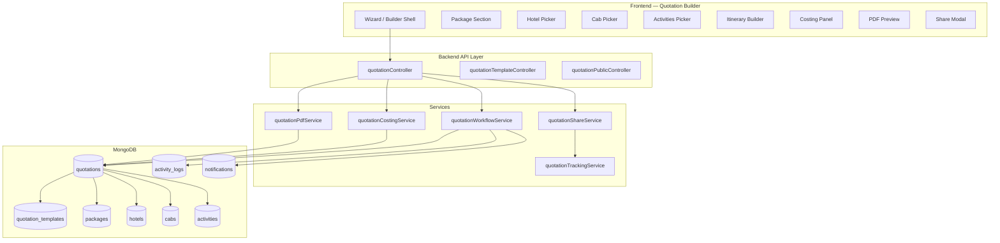
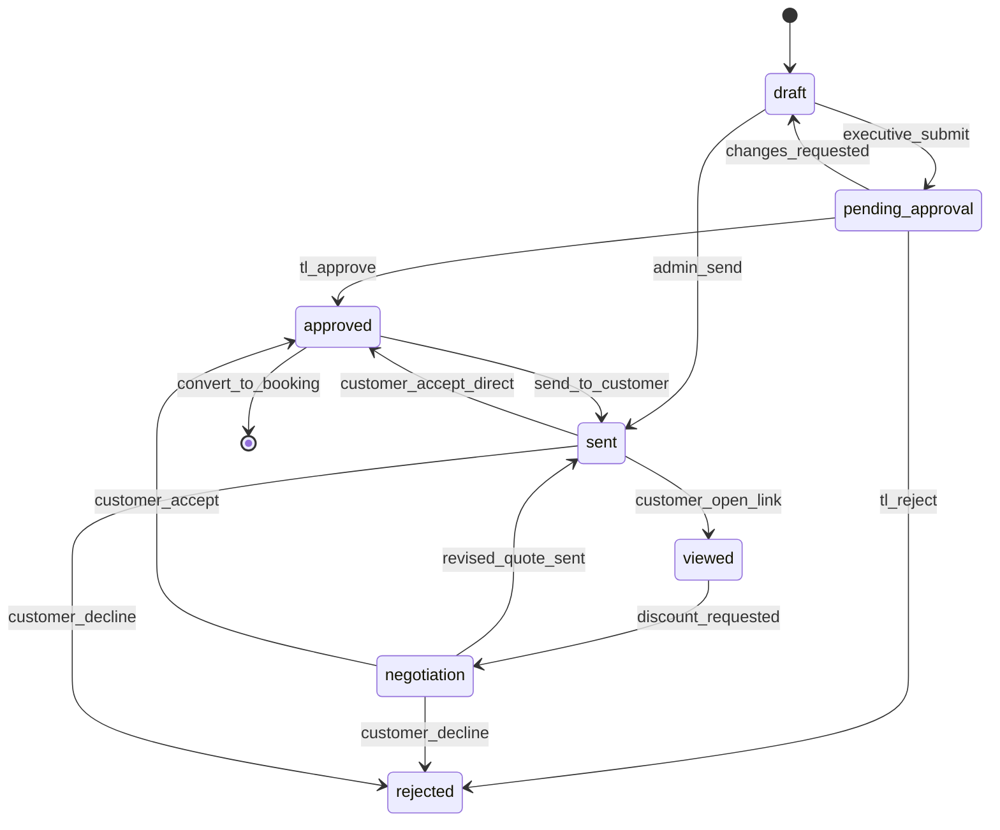
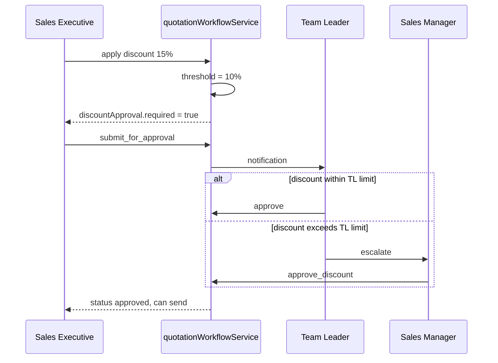
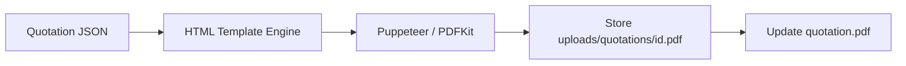
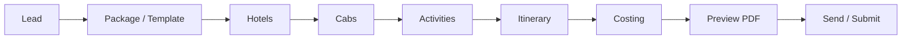

# Enterprise Travel Quotation Builder

> **Scope:** Core revenue module for UNO Travel CRM. Professional travel quotations comparable to leading OTAs / DMCs, with full lifecycle from draft → send → track → approve → convert.

> **Principle:** All pricing, profit, and approval logic runs **server-side**. PDF generation and sharing are auditable. Inventory (packages, hotels, cabs, activities) is **snapshotted** on the quotation so historical quotes never change when master data is updated.

---

## 1. Goals & Non-Goals

### Goals

| # | Capability |
|---|------------|
| 1 | Package Builder (master + quote-level customization) |
| 2 | Hotel / Cab / Activities selection with line-item costing |
| 3 | Day-wise itinerary builder (drag-reorder, per-day components) |
| 4 | Costing engine (subtotal, taxes, markup, discount, grand total) |
| 5 | Discount management (fixed / %, caps, approval thresholds) |
| 6 | Profit calculation (cost vs sell, margin %, target margin alerts) |
| 7 | Dynamic PDF generator (templates, branding per branch) |
| 8 | WhatsApp sharing (link + optional PDF attachment) |
| 9 | Email sharing (HTML + PDF attachment) |
| 10 | Quotation tracking (views, opens, status timeline) |
| 11 | Approval workflow (Executive → Team Leader → optional Sales Manager) |
| 12 | Quotation templates (reusable layouts + default inclusions) |

### Non-Goals (Phase 1)

- Payment gateway / online booking from quote link
- Multi-currency FX (INR only in v1; schema ready for `currency`)
- Customer self-service quote editing
- AI itinerary generation

---

## 2. Current State vs Target

| Area | Today | Target |
|------|--------|--------|
| Model | Basic `Quotation` with `pricing`, mixed snapshots | Rich document with sections, line items, versioning |
| Builder UI | 7-step wizard (lead → package → hotels → pricing) | Enterprise builder with sidebar sections + live PDF preview |
| Activities | Model exists, **not wired** in wizard | Full selection + per-day mapping + costing |
| Costing | Client-side `calculatePricing` | **Server-side** `quotationCostingService` (single source of truth) |
| PDF | React print preview only | Server PDF (Puppeteer/HTML) + public view token |
| Sharing | None | WhatsApp deep link + email via queue |
| Tracking | `timeline[]` only | `tracking` subdoc + public view events |
| Approval | TL approve/reject; SM list | Formal state machine + discount approval rules |
| Templates | None | `QuotationTemplate` collection |
| Branch | `branchId` on quotation | All inventory + templates branch-scoped |

---

## 3. High-Level Architecture



### Layer responsibilities

| Layer | Responsibility |
|-------|----------------|
| **Controller** | Auth, branch scope, validation, HTTP |
| **Workflow service** | Status transitions, approval gates, timeline entries |
| **Costing service** | Line items → subtotals → tax → markup → discount → profit |
| **PDF service** | Render HTML template → PDF buffer → store path / stream |
| **Share service** | Build public URL, WhatsApp text, email payload |
| **Tracking service** | Record view/open events from public token endpoint |
| **Repository** | Paginated lists, filters, aggregates for dashboards |

---

## 4. Quotation Status Machine

### Customer-facing statuses (user spec)

| Status | Code | Description |
|--------|------|-------------|
| Draft | `draft` | Editable; not sent to customer |
| Sent | `sent` | Delivered via email/WhatsApp/link |
| Viewed | `viewed` | Customer opened public quote link |
| Negotiation | `negotiation` | Discount/revision in progress |
| Approved | `approved` | Customer or internal approval to proceed |
| Rejected | `rejected` | Declined by customer or management |

### Internal-only statuses (retain for workflow)

| Status | Code | When |
|--------|------|------|
| Pending Approval | `pending_approval` | Executive submitted; awaiting Team Leader |
| Changes Requested | `changes_requested` | TL sent back for edits (maps to editable draft) |

### State diagram



### Transition rules (server enforced)

| From | Action | To | Roles |
|------|--------|-----|-------|
| `draft` | `submit_for_approval` | `pending_approval` | Sales Executive |
| `pending_approval` | `approve` | `approved` | Team Leader, Sales Manager |
| `pending_approval` | `reject` | `rejected` | Team Leader, Sales Manager |
| `pending_approval` | `request_changes` | `draft` | Team Leader |
| `draft` \| `approved` | `send` | `sent` | Admin, SM, SE (if approved) |
| `sent` | `mark_viewed` | `viewed` | System (public token) |
| `viewed` \| `sent` | `start_negotiation` | `negotiation` | Admin, SM, SE |
| `negotiation` | `revise_and_resend` | `sent` | Admin, SM, SE |
| `*` | `save_draft` | `draft` | Creator, Admin |

Every transition appends to `timeline[]` and `activity_logs`.

---

## 5. MongoDB Collections

### 5.1 `quotations` (extend existing)

**Identity & scope**

| Field | Type | Notes |
|-------|------|-------|
| `quoteNumber` | String | Unique, e.g. `UNO-SHM-2026-00421` |
| `branchId` | ObjectId | Branch isolation |
| `lead` | ObjectId | Required |
| `version` | Number | Increment on duplicate/revise |
| `parentQuotationId` | ObjectId | Revision chain |
| `templateId` | ObjectId | Optional source template |
| `status` | Enum | See §4 |
| `validUntil` | Date | Quote expiry |
| `currency` | String | Default `INR` |

**Trip summary (denormalized for PDF/list)**

| Field | Type |
|-------|------|
| `trip.destination` | String |
| `trip.travelDate` | Date |
| `trip.returnDate` | Date |
| `trip.durationDays` | Number |
| `trip.adults` | Number |
| `trip.children` | Number |
| `trip.hotelCategory` | String |

**Package block**

| Field | Type |
|-------|------|
| `package` | ObjectId → Package |
| `packageSnapshot` | Mixed | Full package at quote time |
| `packageBuilder` | Object | Custom package when not from catalog |

```javascript
packageBuilder: {
  name: String,
  destination: String,
  durationDays: Number,
  packageType: String, // honeymoon | family | ...
  inclusions: [String],
  exclusions: [String],
  notes: String,
}
```

**Component selections (snapshots + line refs)**

```javascript
hotels: [{
  refId: ObjectId,           // Hotel master id (optional)
  snapshot: Mixed,           // name, category, location, roomType, mealPlan
  checkIn: Date,
  checkOut: Date,
  nights: Number,
  rooms: Number,
  costPrice: Number,         // internal cost
  sellPrice: Number,         // quoted to customer
  dayNumbers: [Number],      // linked itinerary days
}],

cabs: [{
  refId: ObjectId,
  snapshot: Mixed,
  pickupDate: Date,
  pickupLocation: String,
  dropLocation: String,
  vehicleType: String,
  costPrice: Number,
  sellPrice: Number,
  dayNumbers: [Number],
}],

activities: [{
  refId: ObjectId,
  snapshot: Mixed,
  date: Date,
  duration: String,
  pax: Number,
  costPrice: Number,
  sellPrice: Number,
  dayNumber: Number,
}],

flights: [{
  refId: ObjectId,
  snapshot: Mixed,
  route: String,
  departureAt: Date,
  costPrice: Number,
  sellPrice: Number,
}],
```

**Itinerary (day-wise)**

```javascript
itinerary: [{
  day: Number,
  title: String,
  description: String,
  meals: String,              // Breakfast, MAP, etc.
  accommodation: String,      // hotel name display
  activities: String,         // summary text
  transport: String,
  hotelId: ObjectId,          // optional link
  activityIds: [ObjectId],
  cabId: ObjectId,
  images: [String],           // URLs for PDF
}],
```

**Costing engine (stored result — never trust client total)**

```javascript
costing: {
  lineItems: [{
    category: String,         // package | hotel | cab | activity | flight | other
    label: String,
    quantity: Number,
    unitCost: Number,
    unitSell: Number,
    costTotal: Number,
    sellTotal: Number,
  }],
  subtotalCost: Number,       // sum of costTotal
  subtotalSell: Number,       // sum of sellTotal before tax/discount
  taxes: [{
    name: String,             // GST, TCS, etc.
    ratePercent: Number,
    amount: Number,
  }],
  taxTotal: Number,
  markup: {
    type: String,             // fixed | percent
    value: Number,
    amount: Number,
  },
  discount: {
    type: String,             // fixed | percent
    value: Number,
    amount: Number,
    reason: String,
    approvedBy: ObjectId,     // required if over threshold
  },
  grandTotal: Number,         // customer pays
  totalCost: Number,          // company cost
  grossProfit: Number,        // grandTotal - totalCost (simplified)
  profitMarginPercent: Number,
  perPersonCost: Number,
  paxCount: Number,
},
```

**Discount approval**

```javascript
discountApproval: {
  required: Boolean,
  thresholdPercent: Number,   // branch config default 10%
  status: String,             // not_required | pending | approved | rejected
  requestedBy: ObjectId,
  approvedBy: ObjectId,
  notes: String,
},
```

**PDF & sharing**

```javascript
pdf: {
  templateKey: String,        // classic | modern | luxury
  generatedAt: Date,
  filePath: String,             // /uploads/quotations/{id}.pdf
  fileSize: Number,
},

sharing: {
  publicToken: String,          // uuid, indexed unique sparse
  publicUrl: String,            // https://domain/q/{token}
  lastSentAt: Date,
  sentVia: [String],            // email | whatsapp | link
  whatsapp: { phone: String, messageId: String, sentAt: Date },
  email: { to: String, subject: String, sentAt: Date },
},

tracking: {
  viewCount: Number,
  firstViewedAt: Date,
  lastViewedAt: Date,
  views: [{ at: Date, ip: String, userAgent: String }],
},
```

**Workflow & audit**

| Field | Type |
|-------|------|
| `timeline[]` | `{ type, date, user, userId, notes, meta }` |
| `createdBy` | ObjectId |
| `createdByExecutive` | ObjectId |
| `teamLeader` | ObjectId |
| `approvedBy` | ObjectId |
| `sentAt` | Date |
| `approvedAt` | Date |
| `rejectedAt` | Date |
| `rejectionReason` | String |
| `customizations` | String (legacy notes) |

**Indexes**

```javascript
{ branchId: 1, status: 1, createdAt: -1 }
{ branchId: 1, lead: 1, createdAt: -1 }
{ quoteNumber: 1 } unique
{ 'sharing.publicToken': 1 } unique sparse
{ branchId: 1, 'costing.profitMarginPercent': 1 }
{ createdBy: 1, status: 1 }
```

---

### 5.2 `quotation_templates` (new)

Reusable starting points for quotes.

| Field | Type | Notes |
|-------|------|-------|
| `name` | String | e.g. "Shimla 5N Honeymoon" |
| `branchId` | ObjectId | |
| `packageType` | String | |
| `destination` | String | |
| `durationDays` | Number | |
| `defaultItinerary` | Array | Same shape as quotation itinerary |
| `defaultInclusions` | [String] | |
| `defaultExclusions` | [String] | |
| `pdfTemplateKey` | String | |
| `defaultMarkupPercent` | Number | |
| `termsAndConditions` | String | HTML/markdown |
| `isActive` | Boolean | |
| `createdBy` | ObjectId | |

---

### 5.3 Master inventory (extend existing)

Add `branchId` to: `packages`, `hotels`, `cabs`, `activities`, `flights`.

**Package** — add:

```javascript
branchId, status: active|archived,
inclusions: [String], exclusions: [String],
coverImage: String, gallery: [String],
defaultHotelCategory: String,
```

**Hotel** — add:

```javascript
branchId, status, checkInTime, checkOutTime,
costPrice, sellPrice,  // separate from display price
amenities: [String], images: [String],
```

**Cab** — add:

```javascript
branchId, status, seats, acType,
costPrice, sellPrice, perDayRate, perKmRate,
```

**Activity** — add:

```javascript
branchId, category, minPax, maxPax,
costPrice, sellPrice, images: [String],
```

---

### 5.4 `quotation_settings` (new, per branch)

| Field | Type |
|-------|------|
| `branchId` | ObjectId |
| `quoteNumberPrefix` | String | e.g. `UNO-SHM` |
| `defaultValidityDays` | Number | 7 |
| `discountApprovalThresholdPercent` | Number | 10 |
| `minProfitMarginPercent` | Number | 5 |
| `defaultTaxes` | `[{ name, ratePercent }]` |
| `companyBranding` | `{ name, logo, phone, email, address, gstin }` |
| `pdfDefaults` | `{ templateKey, footerText }` |
| `whatsappTemplate` | String |
| `emailTemplate` | String |

---

## 6. Costing Engine (Server)

### Formula (single source of truth)

```
lineItems[] → each: costTotal = qty × unitCost, sellTotal = qty × unitSell

subtotalCost  = Σ costTotal
subtotalSell  = Σ sellTotal

taxTotal      = Σ (taxableBase × rate%)   // taxableBase = subtotalSell (v1)
markupAmount  = fixed OR (subtotalSell × markup%)
discountAmount= fixed OR (subtotalSell × discount%)

grandTotal    = subtotalSell + taxTotal + markupAmount - discountAmount
totalCost     = subtotalCost + allocated tax on cost (optional v1: subtotalCost only)
grossProfit   = grandTotal - totalCost
margin%       = (grossProfit / grandTotal) × 100   if grandTotal > 0
perPerson     = grandTotal / paxCount
```

### Validation rules

| Rule | Error |
|------|-------|
| `grandTotal < 0` | Invalid discount |
| `discount > subtotalSell × threshold` | Requires `discountApproval` |
| `profitMargin < minProfitMargin` | Warning (allow override with Admin note) |
| Status `sent` without `pdf.filePath` | Generate PDF first |
| Missing `lead`, `itinerary.length >= 1` | Cannot send |

### API: recalculate

```
POST /api/quotations/:id/recalculate
Body: { hotels, cabs, activities, flights, markup, discount, taxes }
Response: { costing, warnings[] }
```

---

## 7. Approval Workflow

### Roles

| Role | Permissions |
|------|-------------|
| Sales Executive | Create, edit draft, submit for approval, send (if approved) |
| Team Leader | Approve/reject team quotes, request changes, send |
| Sales Manager | Approve high discount, all branch quotes, send |
| Admin | Full access, template management, override margin |

### Discount approval flow



---

## 8. API Design

### 8.1 Admin / shared (`/api/quotations`)

| Method | Path | Description |
|--------|------|-------------|
| GET | `/` | List (paginated, filter: status, lead, date, margin) |
| GET | `/stats` | Dashboard counters |
| POST | `/` | Create draft |
| GET | `/:id` | Full quotation |
| PUT | `/:id` | Update (draft/negotiation only) |
| DELETE | `/:id` | Soft-delete draft only |
| POST | `/:id/recalculate` | Run costing engine |
| POST | `/:id/duplicate` | Clone as new draft |
| POST | `/:id/submit` | → pending_approval |
| POST | `/:id/send` | Generate PDF + mark sent + share payload |
| POST | `/:id/share/whatsapp` | Log + return wa.me link |
| POST | `/:id/share/email` | Queue email with PDF |
| GET | `/:id/pdf` | Download PDF |
| POST | `/:id/pdf/regenerate` | Force regenerate |
| PUT | `/:id/status` | Controlled transition |
| GET | `/:id/timeline` | Activity timeline |

### 8.2 Templates (`/api/quotation-templates`)

| Method | Path | Description |
|--------|------|-------------|
| GET | `/` | List templates |
| POST | `/` | Create |
| GET | `/:id` | Get |
| PUT | `/:id` | Update |
| DELETE | `/:id` | Archive |
| POST | `/:id/apply` | Create quotation from template |

### 8.3 Public (no auth, token-based)

| Method | Path | Description |
|--------|------|-------------|
| GET | `/api/public/quotes/:token` | Customer view (HTML) |
| POST | `/api/public/quotes/:token/view` | Record view → status viewed |
| GET | `/api/public/quotes/:token/pdf` | Download PDF |

### 8.4 Role-scoped (existing pattern)

| Prefix | Notes |
|--------|-------|
| `/api/sales-executive/quotations` | Create, own quotes |
| `/api/team-leader/quotations/:segment` | pending / approved / rejected |
| `/api/sales-manager/quotations/:segment` | + discount approval |

### 8.5 Inventory (extend)

| Resource | Endpoints |
|----------|-----------|
| Packages | CRUD + `branchId` filter |
| Hotels | CRUD + search by destination/category |
| Cabs | CRUD |
| Activities | CRUD |
| Flights | CRUD |

---

## 9. PDF Structure

### Template keys

| Key | Style |
|-----|--------|
| `classic` | Serif, amber accents (current preview) |
| `modern` | Sans-serif, brand gradient header |
| `luxury` | Dark header, gold accents, full-bleed cover |

### Page layout (multi-page)

**Page 1 — Cover**

- Company logo + branch name
- Quote number, date, valid until
- Customer name, destination, travel dates, pax
- Hero image (destination / package)
- Grand total (prominent)

**Page 2 — Trip overview**

- Package name & type badge
- Inclusions / exclusions
- Highlights bullets

**Page 3+ — Day-wise itinerary**

- For each day: title, description, meals, hotel, activities, transport
- Optional day image

**Page N — Cost breakdown**

| Line | Amount |
|------|--------|
| Package base | ₹ |
| Hotels (itemized) | ₹ |
| Transport | ₹ |
| Activities | ₹ |
| Flights | ₹ |
| Taxes | ₹ |
| Discount | −₹ |
| **Grand Total** | **₹** |
| Per person | ₹ |

**Footer (all pages)**

- Terms & conditions
- Payment terms (advance %, balance due)
- GSTIN, company contact
- "This is a computer-generated quotation"

### Generation pipeline



**Tech choice:** `puppeteer` (HTML→PDF) for pixel-perfect travel brochures; fallback `pdfkit` for VPS without Chrome.

---

## 10. WhatsApp & Email Sharing

### WhatsApp

```
POST /quotations/:id/share/whatsapp
Body: { phone, includePdfLink: true }

Response:
{
  waLink: "https://wa.me/91XXXXXXXXXX?text=...",
  message: "Hi {name}, your {destination} quote {quoteNumber} is ready. Total: ₹{total}. View: {publicUrl}"
}
```

- Uses `sharing.publicUrl` with token
- Does not auto-send via Business API in v1 (manual send via link)
- Phase 2: WhatsApp Cloud API integration

### Email

```
POST /quotations/:id/share/email
Body: { to, cc, subject, message }

Actions:
1. Ensure PDF exists
2. Send via nodemailer (existing SMTP config)
3. HTML body + PDF attachment
4. timeline: type=email_sent
5. status → sent (if was approved/draft per rules)
```

---

## 11. Quotation Tracking

| Event | Trigger | Storage |
|-------|---------|---------|
| Created | POST /quotations | timeline |
| Submitted | submit | timeline + notification |
| Approved | TL/SM approve | timeline |
| Sent | send/email/whatsapp | timeline, sharing.lastSentAt |
| Viewed | public token GET | tracking.views[], status→viewed |
| Negotiation | manual status | timeline |
| Revised | duplicate/version++ | parentQuotationId |

### Dashboard widgets

- Quotes sent this week
- View rate % (viewed / sent)
- Avg profit margin
- Pending approval count
- Expiring soon (validUntil < 3 days)

---

## 12. Frontend Module Structure

```
frontend/src/
  features/quotations/
    api/quotationApi.js
    hooks/
      useQuotationBuilder.js      # wizard state + save
      useQuotationCosting.js      # debounced recalculate
      useQuotationShare.js
    components/
      QuotationBuilderShell.jsx   # layout: sidebar + main + preview
      sections/
        LeadSection.jsx
        PackageSection.jsx
        HotelSection.jsx
        CabSection.jsx
        ActivitySection.jsx
        ItinerarySection.jsx      # reuses ItineraryBuilder
        CostingSection.jsx        # QuotePricingPanel enhanced
        ReviewSection.jsx
      ShareQuotationModal.jsx
      QuotationStatusBadge.jsx
      QuotationTimeline.jsx
    pages/
      QuotationListPage.jsx       # migrate from components/quotations
      QuotationBuilderPage.jsx    # replaces QuotationBuilderWizard
      QuotationDetailPage.jsx
      QuotationTemplatesPage.jsx
    utils/
      quotationCosting.js         # display helpers only
      quotationValidation.js
  components/quotations/
    QuotePdfPreview.jsx           # keep for live preview
    pdf-templates/                # HTML strings per template key
```

### Builder UX flow



- Left nav: section list with completion checkmarks
- Center: active section form
- Right (xl+): live PDF preview panel
- Sticky footer: Save Draft | Recalculate | Submit / Send

---

## 13. Backend Module Structure

```
backend/src/
  models/
    Quotation.js              # extended schema
    QuotationTemplate.js      # new
    QuotationSettings.js      # new
  services/
    quotationCostingService.js
    quotationWorkflowService.js
    quotationPdfService.js
    quotationShareService.js
    quotationTrackingService.js
  controllers/
    quotationController.js    # extended
    quotationTemplateController.js
    quotationPublicController.js
  repositories/
    quotationRepository.js
    quotationTemplateRepository.js
  routes/
    quotationRoutes.js
    quotationTemplateRoutes.js
    quotationPublicRoutes.js
  templates/pdf/
    classic.html
    modern.html
    luxury.html
```

---

## 14. Security & Branch Isolation

- All quotation queries use `withBranch(req.branchId)`
- Public token: UUID v4, no sequential IDs, optional expiry
- Rate-limit public view endpoint
- PDF files served via authenticated route OR signed short-lived URL
- Executives see only own quotes; TL sees team; SM/Admin see branch

---

## 15. Migration Plan (existing data)

1. Add new subdocuments with defaults (`costing` from legacy `pricing`)
2. Map `packageSnapshot.itinerary` → `itinerary`
3. Map `selectedHotels/Cabs/Flights` → `hotels/cabs/flights` arrays
4. Generate `sharing.publicToken` for existing `sent` quotes
5. Backfill `branchId` from lead.branchId

---

## 16. Implementation Phases

### Phase 1 — Foundation (Week 1)

- [ ] Extend `Quotation` schema + migration script
- [ ] `quotationCostingService` + recalculate API
- [ ] Extend builder: Activities section, server-side totals
- [ ] Branch scope on inventory models

### Phase 2 — PDF & Sharing (Week 2)

- [ ] HTML PDF templates (classic, modern)
- [ ] `quotationPdfService` + download endpoint
- [ ] Public token + view tracking
- [ ] WhatsApp link + email send

### Phase 3 — Workflow & Templates (Week 3)

- [ ] `QuotationTemplate` CRUD + apply
- [ ] Discount approval thresholds
- [ ] Enhanced TL/SM approval UI
- [ ] Quotation detail page with timeline

### Phase 4 — Enterprise polish (Week 4)

- [ ] Luxury PDF template
- [ ] Dashboard widgets + reports
- [ ] Versioning / revision chain
- [ ] WhatsApp Business API (optional)

---

## 17. Sample Quote Number Format

```
{prefix}-{YYYY}-{sequence}
UNO-SHM-2026-00042
```

Generated in `quotationSettings.quoteNumberPrefix` + atomic counter collection `counters`.

---

## 18. Acceptance Criteria

- [ ] User can build a quote with package, hotels, cabs, activities, day-wise itinerary
- [ ] Grand total and profit margin computed **only on server**
- [ ] PDF matches preview and downloads correctly
- [ ] WhatsApp share opens with pre-filled message + link
- [ ] Email sends with PDF attachment
- [ ] Customer opening link marks quote `viewed` and increments view count
- [ ] Executive submit → TL approve → send workflow works end-to-end
- [ ] Discount above threshold requires approval before send
- [ ] All data stored in MongoDB with branch isolation
- [ ] Lost lead linkage: quotation activity appears on lead timeline

---

## 19. Open Decisions (confirm before Phase 1 code)

| # | Question | Recommendation |
|---|----------|----------------|
| 1 | Keep `pending_approval` as separate status? | **Yes** — internal workflow; map to "Pending" badge in UI |
| 2 | Puppeteer on VPS? | Install Chromium dep OR use `@sparticuz/chromium` for serverless-style |
| 3 | Public quote page branding | Per `quotation_settings.companyBranding` per branch |
| 4 | Flight module in builder? | **Yes** — optional step; already have Flight model |
| 5 | Soft delete quotations? | `isDeleted: true` on draft only |

---

*Document version: 1.0 — Design only. Implementation starts after approval.*
